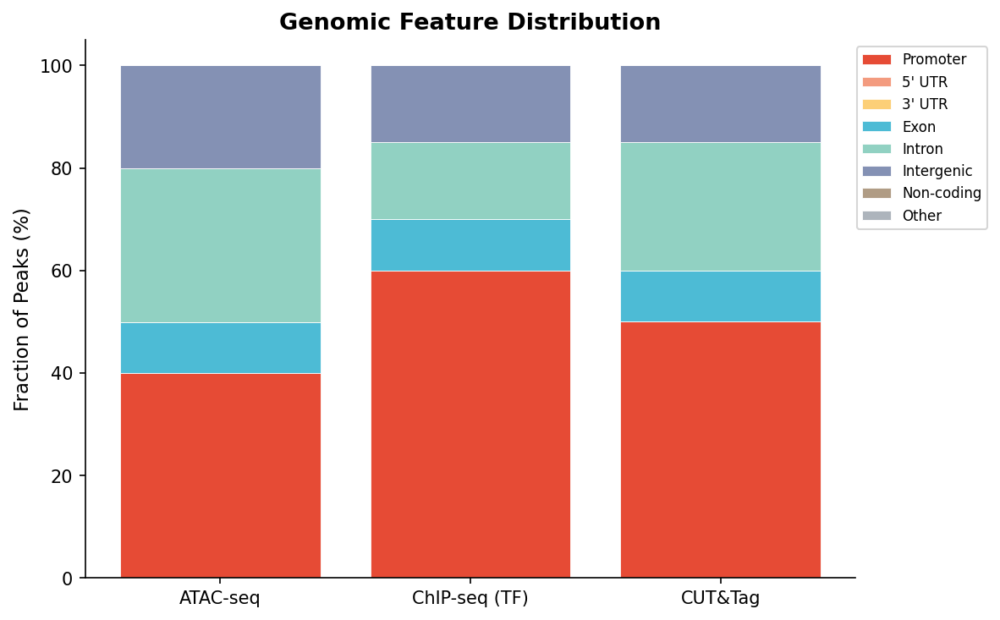
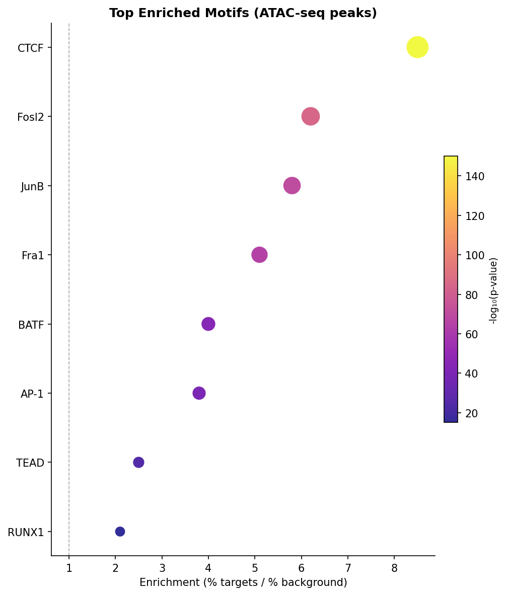
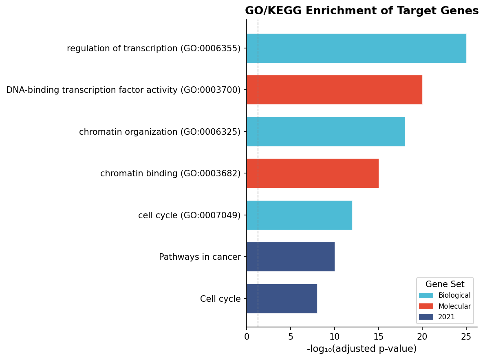
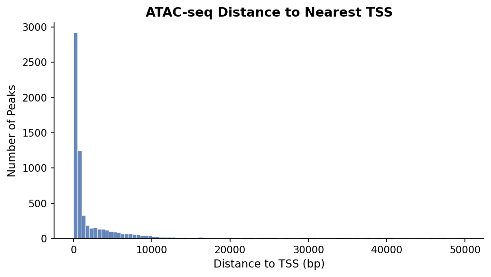

# 🧬 ChromatinTrek

> **End-to-End Chromatin NGS Analysis Pipeline**
>
> A modular, best-practice Snakemake orchestrator for ATAC-seq, ChIP-seq, and CUT&Tag data analysis.

[](https://www.python.org/downloads/)
[](https://snakemake.readthedocs.io)
[](https://opensource.org/licenses/MIT)

ChromatinTrek takes you from raw FASTQ files to publication-ready enrichment figures in a single command. It wraps industry-standard tools (Bowtie2, MACS3, deepTools, HOMER) into a clean Python API, intelligently adjusting parameters based on your assay type (ATAC, ChIP, or CUT&Tag).

---

## 🎯 Key Features

- **Assay-Aware Presets**: Automatically applies custom `bowtie2` mapping constraints and `MACS3` peak-calling shifts optimized for ATAC-seq, ChIP-seq, or CUT&Tag.
- **Auto-Resolution of Genomes**: Just specify `species: human` or `mouse`. The pipeline automatically downloads and indexes the reference genome, GTF, blacklists, and chrom sizes.
- **HPC Ready**: First-class SLURM support via Snakemake profiles.
- **End-to-end Outputs**:
  - Full QC with MultiQC
  - Normalized bigWig tracks
  - Peak-to-gene distances & genomic feature distributions
  - TF Motif enrichment (Homes)
  - Gene Ontology (gseapy)

---

## 📦 Installation

ChromatinTrek requires `conda` to manage its bioinformatics dependencies.

```bash
# 1. Clone the repository
git clone https://github.com/Wuyuefeng-dev/ChromatinTrek.git
cd ChromatinTrek

# 2. Create the conda environment
conda env create -f environment.yaml
conda activate chromatintrek

# 3. Install the Python package wrapper
pip install -e .
```

---

## 🚀 Quick Start Demo

ChromatinTrek includes a built-in synthetic dataset generator for a fast, local end-to-end test.

```bash
# 1. Generate demo reads, a real chr22 sub-genome (4Mb), and Bowtie2 index
python demo/generate_demo_data.py --threads 4 --reads 50000

# 2. Run the demo pipeline
snakemake --snakefile Snakefile --configfile demo/demo_config.yaml --cores 4 --use-conda
```

---

## 📊 Example Outputs

The pipeline generates publication-quality visualization automatically from MACS3 and HOMER outputs.

<div align="center">
  <h3>Genomic Feature Distribution</h3>
  
  <p><i>Distribution of peaks across promoter, exonic, intronic, and intergenic regions.</i></p>

  <h3>Transcription Factor Motif Enrichment</h3>
  
  <p><i>Top enriched HOMER motifs by hypergeometric p-value and target coverage (ATAC-seq peaks).</i></p>

  <h3>Gene Ontology Enrichment</h3>
  
  <p><i>gseapy enrichment of genes assigned to peaks, split by GO/KEGG category.</i></p>

  <h3>Distance to Nearest TSS</h3>
  
  <p><i>Histogram showing the high concentration of ATAC/CUT&Tag peaks at the core promoter.</i></p>
</div>

---

## 🛠️ Usage for Your Own Data

### 1. Configure the Run

Edit `config.yaml` to specify your species and assay type. If you already have a genome FASTA and Bowtie2 index, add them here so the pipeline skips downloading them:

```yaml
species: "human"    # human (hg38) or mouse (mm10)
assay:   "atac"     # atac | chip | cuttag

# Optional: define comparison groups for differential blocks
comparisons:
  - "KO_vs_WT"

# Optional: provide pre-built index
genome_fasta:  "/path/to/hg38.fa"
bowtie2_index: "/path/to/bowtie2/hg38"
```

### 2. Prepare Sample Sheet

Fill out `samples.tsv` with your FASTQ paths:

| sample   | fastq_r1 | fastq_r2 | group | comparison |
|----------|----------|----------|-------|------------|
| WT_rep1  | WT1_R1.fq.gz | WT1_R2.fq.gz | WT | KO_vs_WT |
| KO_rep1  | KO1_R1.fq.gz | KO1_R2.fq.gz | KO | KO_vs_WT |

### 3. Setup Genome (Optional)
If you didn't provide index paths in the config, run this command to download the FASTA, blacklists, GTF, and build the Bowtie2 index automatically (takes ~60 mins):
```bash
chromatintrek setup-genome --species human
```

### 4. Run the Pipeline

**Local execution (Single Node):**
```bash
chromatintrek run --config config.yaml --cores 16
```

**HPC execution (SLURM cluster):**
```bash
chromatintrek run --config config.yaml --slurm
```
*(You can modify default cluster resources in `profiles/slurm/config.yaml`)*

---

## 🏗️ Pipeline Architecture

1. **QC:** `FastQC` → `Trim Galore` → `MultiQC`
2. **Alignment:** `Bowtie2` → `samtools markdup` → Filter by MAPQ (≥30) and ENCODE blacklists
3. **Peak Calling:** `MACS3 callpeak` (Assay-specific flags, e.g., shift and extend for ATAC)
4. **Visualization:** `deepTools bamCoverage` (RPGC bigWigs), `computeMatrix`, heatmaps, profiles
5. **Motifs:** `HOMER findMotifsGenome.pl`
6. **Annotation:** Nearest gene mapping and summary fraction plots
7. **GO:** Pathway enrichment via `gseapy`
